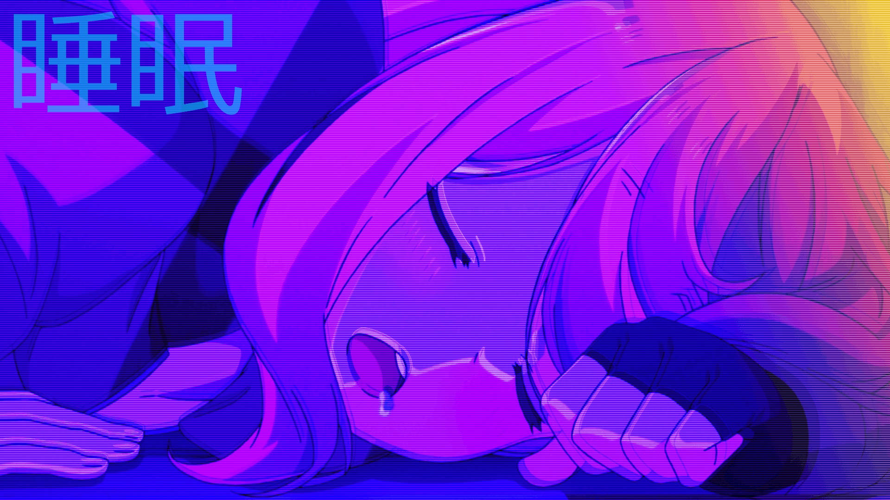

<h1 align="center">✨ LunaryRoll 🌙</h1>

> Este repositório é dedicado para realização do PI (Projeto integrador) do curso TI24 em programação, com aprendizado com docente [Paulo](https://github.com/paulowh). Bem-vindo ao LunaryRoll, uma plataforma de streaming de anime e leitura de mangá. Feito pelos alunos Matheus Dantas & Vitor Barduco


<section align="center">
    <h2>✨ Linguagens & Tecnologias Usadas para o desenvolvimento desse repositório</h2>
    <div>
        
        
        
        
        
    </div>
    <div>
        
        
        
        
    </div>
    <div>
        
        
    </div>  
</section>

<div align="center">
    <h2>💻 Preview ✨</h2>
    <div>
        <a href="http://cine-box.vercel.app">
            
        </a>
        <a href="http://downzin01.github.io/LunaryRoll/">
            
        </a>
    <div>
    <br>
    <a href="http://cine-box.vercel.app">
        
    </a>
</div>

<h1 align="center">💻 Clonagem do repositório</h1>

Baixe e instale o [GIT](https://git-scm.com/)

```bash
# Clone esse repositório
git clone https://github.com/Downzin01/LunaryRoll.git
```
```bash
# Vá para o repositório 
cd LunaryRoll
```

<section>
    <h2>✨ Contribuidores 👥</h2>
    <table>
        <tr>
            <td valign="top">
                <a href="https://github.com/Downzin01">
                    
                    <p align="center">Downzin01</p>
                </a>
            </td>
            <td valign="top">
                <a href="https://github.com/VitorFraz">
                    
                    <p align="center">VitorFraz</p>
                </a>
            </td>
        </tr>
    </table>
    <p>Se você gostaria de contribuir, sinta-se à vontade para abrir um pull request ou issue!</p>
</section>

###

<section id="contato">
  <div align="center">
    <h2>💻 Contato </h2>
    <p><blockquote>😀 Se você tiver sugestões, feedback ou quiser colaborar em algum projeto, ficarei feliz em ouvir de você! 😁stou constantemente buscando aprimorar minhas habilidades e expandir meus conhecimentos nas diversas tecnologias que mencionei. A jornada de aprendizado é contínua e estou animado para explorar novas oportunidades e desafios. 😸</blockquote></p>
    <div>
      <a href="mailto:dantasmatheus001@gmail.com">
        
      </a>
      <a href="https://www.instagram.com/downzin_" rel="nofollow">
        
      </a>
      <a href="https://x.com/DownloaderChan1" rel="nofollow">
        
      </a>
      <a href="https://discord.com/users/576935681167982595">
        
      </a>
    </div>
  </div>
</section>